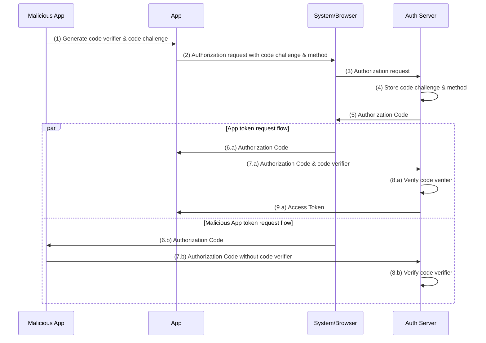

# PKCE 기반 OAuth 2.0 인증

## 개요

Mockly 모바일 앱은 **Authorization Code Flow with PKCE (Proof Key for Code Exchange)**를 사용하여 Google OAuth 인증을 구현합니다.

## PKCE란?

PKCE는 모바일 및 네이티브 앱에서 OAuth 2.0을 안전하게 사용하기 위한 확장 기능입니다:

- **목적**: Authorization Code를 가로채는 공격 방지
- **원리**: Code Verifier와 Code Challenge를 사용한 동적 시크릿
- **장점**: 클라이언트 시크릿 없이도 안전한 인증 가능

## 아키텍처

### 전통적인 방식 (우리가 사용하지 않음)

```
Mobile App → Google OAuth → Backend Server → Mobile App
           (Code)          (Token Exchange)  (Access Token)
```

### PKCE 방식 (우리가 사용하는 방식)

```
Mobile App → Google OAuth → Mobile App
           (Code + Verifier) (Direct Token Exchange)
```

## 주요 특징

### 1. Token Exchange Skip 안함

```typescript
const result = await authorize({
  issuer: 'https://accounts.google.com',
  clientId: googleAuthConfig.clientId,
  redirectUrl: googleAuthConfig.redirectUrl,
  scopes: googleAuthConfig.scopes,
  usePKCE: true, // PKCE 활성화
  skipCodeExchange: false, // 토큰 교환을 클라이언트에서 직접 처리
});
```

### 2. 자동 토큰 갱신

- Access Token 만료 5분 전 자동 갱신
- Refresh Token을 사용한 무중단 세션 유지

```typescript
if (
  isTokenExpiringSoon(result.accessTokenExpirationDate) &&
  result.refreshToken
) {
  const refreshed = await refreshAccessToken(result.refreshToken);
  // 새로운 토큰으로 업데이트
}
```

### 3. 안전한 토큰 저장

- AsyncStorage를 사용한 로컬 저장
- 암호화된 토큰 저장 (기기 레벨)

```typescript
const AUTH_STORAGE_KEY = '@mockly_auth_state';
await AsyncStorage.setItem(AUTH_STORAGE_KEY, JSON.stringify(authState));
```

## 플로우



### 로그인 플로우

1. 사용자가 "Google로 로그인" 버튼 클릭
2. `authorizeWithPKCE()` 호출
3. Code Verifier 생성 (무작위 문자열)
4. Code Challenge 생성 (Code Verifier의 SHA-256 해시)
5. Google OAuth 페이지로 리다이렉트 (Code Challenge 포함)
6. 사용자 인증 후 Authorization Code 수신
7. Authorization Code + Code Verifier로 토큰 교환
8. Access Token, Refresh Token, ID Token 수신
9. ID Token에서 사용자 정보 추출
10. AsyncStorage에 토큰 저장

### 토큰 갱신 플로우

1. 앱 시작 시 저장된 토큰 확인
2. 토큰 만료 여부 검사
3. 만료되었으면 Refresh Token으로 갱신
4. 새로운 토큰으로 업데이트

### 로그아웃 플로우

1. 사용자가 로그아웃 버튼 클릭
2. `revokeToken()` 호출하여 Google에 토큰 폐기 요청
3. 로컬 토큰 및 사용자 정보 삭제
4. AsyncStorage 클리어

## 보안 고려사항

### 1. PKCE 사용

- Authorization Code 가로채기 공격 방지
- 클라이언트 시크릿 불필요 (네이티브 앱에서 안전하게 보관 불가능)

### 2. Token Rotation

- Refresh Token 사용 시마다 새로운 Refresh Token 발급
- 이전 Refresh Token 무효화

### 3. Secure Storage

- Android: EncryptedSharedPreferences
- iOS: Keychain

### 4. Token Validation

- ID Token 서명 검증
- Token 만료 시간 확인

## 설정

### Android

`android/app/src/main/AndroidManifest.xml`:

```xml
<intent-filter>
    <action android:name="android.intent.action.VIEW" />
    <category android:name="android.intent.category.DEFAULT" />
    <category android:name="android.intent.category.BROWSABLE" />
    <data android:scheme="com.mockly.mobile"
          android:host="oauth2redirect"
          android:pathPrefix="/google" />
</intent-filter>
```

### iOS

`ios/mobile/Info.plist`:

```xml
<key>CFBundleURLTypes</key>
<array>
    <dict>
        <key>CFBundleURLSchemes</key>
        <array>
            <string>com.mockly.mobile</string>
        </array>
    </dict>
</array>
```

### Google Cloud Console

1. OAuth 2.0 클라이언트 ID 생성
2. 애플리케이션 유형: **웹 애플리케이션** (모바일이 아님!)
3. 승인된 리디렉션 URI:
   - `com.mockly.mobile:/oauth2redirect/google`

## 환경 변수

`.env`:

```
GOOGLE_WEB_CLIENT_ID=your-google-web-client-id.apps.googleusercontent.com
```

## 사용 예제

### 로그인

```typescript
import { useAuth } from '../hooks/useAuth';

const { signIn } = useAuth();

const handleGoogleLogin = async () => {
  try {
    await signIn('google');
    // 로그인 성공
  } catch (error) {
    console.error('로그인 실패:', error);
  }
};
```

### 로그아웃

```typescript
const { signOut } = useAuth();

const handleLogout = async () => {
  try {
    await signOut();
    // 로그아웃 성공
  } catch (error) {
    console.error('로그아웃 실패:', error);
  }
};
```

### 사용자 정보 접근

```typescript
const { user, isAuthenticated } = useAuth();

if (isAuthenticated && user) {
  console.log('사용자 이메일:', user.email);
  console.log('사용자 이름:', user.name);
}
```

## 트러블슈팅

### "Redirect URI mismatch" 에러

- Google Cloud Console에서 리디렉션 URI 확인
- 대소문자 및 슬래시 정확히 일치해야 함
- `com.mockly.mobile:/oauth2redirect/google` (콜론 앞에 슬래시 없음)

### Token 갱신 실패

- Refresh Token이 만료되었을 수 있음 (보통 6개월)
- 재로그인 필요

### Android 빌드 에러

- `react-native-app-auth` 패키지가 올바르게 링크되었는지 확인
- `npx react-native link react-native-app-auth` 실행

## 참고 자료

- [RFC 7636: PKCE](https://tools.ietf.org/html/rfc7636)
- [OAuth 2.0 for Native Apps](https://tools.ietf.org/html/rfc8252)
- [react-native-app-auth](https://github.com/FormidableLabs/react-native-app-auth)
- [Google OAuth 2.0](https://developers.google.com/identity/protocols/oauth2)
