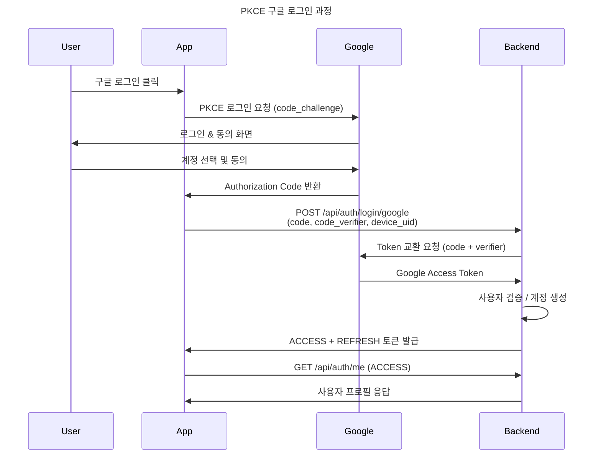
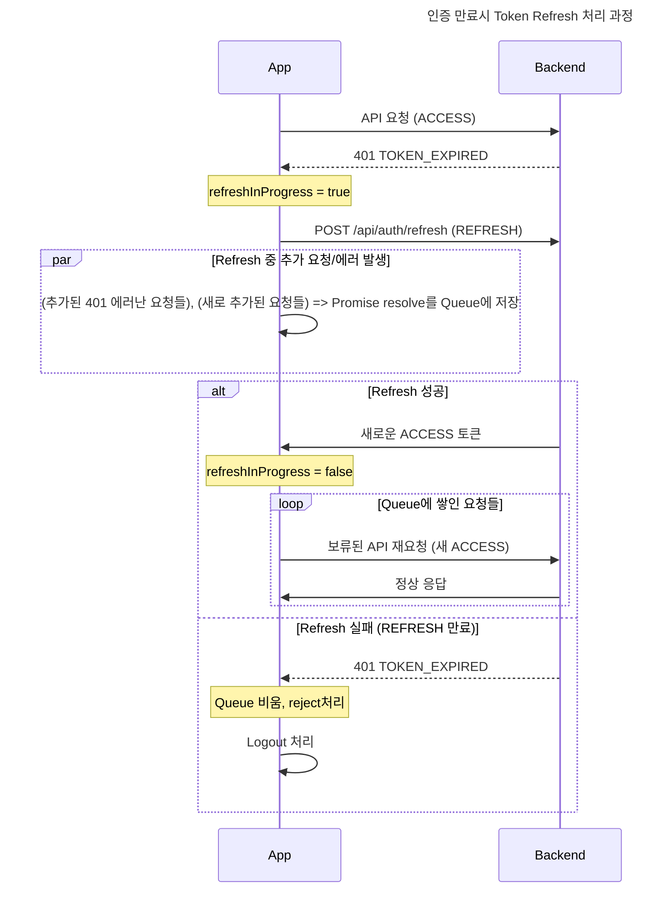
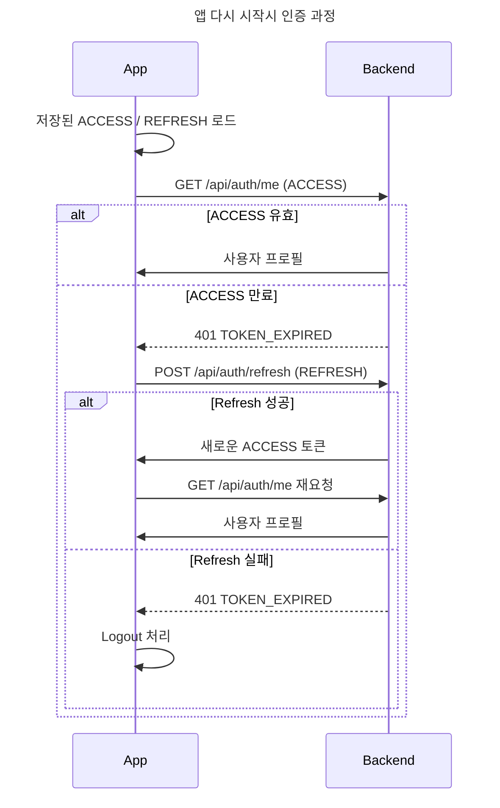

## PKCE 구글 로그인 과정

## 인증 만료시 Token Refresh 재인증 과정

## 앱 다시 시작시 인증 과정

## 참고 자료

- [RFC 7636: PKCE](https://tools.ietf.org/html/rfc7636)
- [OAuth 2.0 for Native Apps](https://tools.ietf.org/html/rfc8252)
- [react-native-app-auth](https://github.com/FormidableLabs/react-native-app-auth)
- [Google OAuth 2.0](https://developers.google.com/identity/protocols/oauth2)
